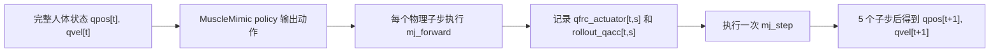

# 全身广义力回放逻辑与数据管理

## 1. 目的和边界

当前方法先让 MuscleMimic 的完整肌肉人体跟踪一条动作，再记录肌肉系统在每个 MuJoCo
物理子步产生的主动广义力 `qfrc_actuator`。回放时关闭原肌肉 actuator，将记录的广义力
通过 `qfrc_applied` 注入相同模型。

这不是回放肌肉 activation，也不是把关节位置直接写回模型。回放期间：

- 人体状态由 MuJoCo 积分演化；
- 重力和 `qfrc_passive` 由当前状态重新计算；
- 接触、摩擦和 `qfrc_constraint` 由 MuJoCo 重新求解；
- 只回放原完整人体产生的主动广义力；
- 假肢训练阶段只替换左膝和左踝—足 4 DOF 的主动广义力。

因此，完整人体回放是训练假肢之前的物理基线和数据质量门禁。

## 2. 从肌肉控制到广义力

在原 MuscleMimic tracker 中，policy 输出肌肉/actuator 控制量。MuJoCo 根据 actuator
传动、肌肉状态、力—长度—速度关系等计算 actuator force，并映射成广义坐标上的
`data.qfrc_actuator`。

可以把每个物理子步的动力学边界简化为：

\[
M(q)\ddot q + b(q,\dot q)
=qfrc_{actuator}+qfrc_{passive}+qfrc_{applied}+qfrc_{constraint}.
\]

导出阶段记录的是完整肌肉人体已经计算好的 `qfrc_actuator`。回放阶段将原 actuator
输出清零，并设置：

\[
qfrc_{applied}=qfrc_{actuator}^{recorded}.
\]

只要初始 MuJoCo 状态、warmstart、模型参数和每个子步的广义力一致，物理演化就应与
原 rollout 一致。

## 3. 导出时序

当前 motion 为 100 Hz 控制频率，MuJoCo 为 500 Hz 物理频率，即每个控制步有 5 个
物理子步。



严格时间语义为：

```text
rollout_qpos[t], rollout_qvel[t]
    -- qfrc_actuator[t, 0:5] -->
rollout_qpos[t+1], rollout_qvel[t+1]
```

导出器在每次 `mj_step(..., 1)` 前调用 `mj_forward`，然后记录该物理子步的：

- `rollout_qacc`；
- `actuator_ctrl`；
- `actuator_force`；
- `qfrc_actuator`；
- `qfrc_passive`；
- `qfrc_constraint`；
- `contact_ncon`。

相关实现：

- `torque_replay_training/src/torque_replay_training/exporter.py`
- `torque_replay_training/scripts/export_fullbody_rollout.py`
- `torque_replay_training/scripts/collect_rollouts.py`

## 4. schema v2

正式数据目录为：

```text
torque_replay_training/data/fullbody_v2
```

最重要的数据字段是：

| 字段 | 形状 | 精度 | 用途 |
|---|---|---|---|
| `rollout_qpos` | `[T+1,nq]` | float64 | 原 tracker 状态 |
| `rollout_qvel` | `[T+1,nv]` | float64 | 原 tracker 速度 |
| `rollout_qacc` | `[T,S,nv]` | float64 | 子步加速度和随机 reset warmstart |
| `qfrc_actuator` | `[T,S,nv]` | float64 | 正式回放主动广义力 |
| `policy_action` | `[T,na]` | float32 | 原 tracker 动作审计 |
| `actuator_force` | `[T,S,nu]` | float32 | 肌肉力审计 |
| `qfrc_passive` | `[T,S,nv]` | float32 | 被动力审计，不直接回放 |
| `qfrc_constraint` | `[T,S,nv]` | float32 | 接触约束审计，不直接回放 |

`qfrc_actuator` 和 `rollout_qacc` 必须是 float64。旧 schema v1 将二者保存为 float32，
单步误差虽然很小，但会在约 1–1.5 秒后被足地接触动力学放大，最终进入不同的接触模式。
加载器会拒绝 schema v1，不能把旧文件直接改名成 v2。

## 5. 回放环境初始化

`TorqueReplayEnv` 使用原 MyoFullBody 模型，但先彻底关闭原 actuator 路径：

1. 将 `model.actuator_gainprm` 和 `model.actuator_biasprm` 清零；
2. 将 `data.ctrl` 和 `data.act` 清零；
3. 将 `data.qfrc_applied` 清零；
4. 调用 `mj_forward`；
5. 检查 `data.qfrc_actuator` 是否仍有泄漏。

每次 episode reset 会恢复：

```text
qpos             = rollout_qpos[start_step]
qvel             = rollout_qvel[start_step]
time             = start_step * dt_control
qacc_warmstart   = 0                              , start_step == 0
qacc_warmstart   = rollout_qacc[start_step-1,-1] , start_step > 0
```

恢复 `qacc_warmstart` 是随机起点精确回放的必要条件。只恢复 `qpos/qvel` 会在接触帧引入
求解器扰动，随后产生累计发散。

相关实现：

- `torque_replay_training/src/torque_replay_training/replay_env.py`
- `torque_replay_training/src/torque_replay_training/schema.py`

## 6. 每个物理子步的执行

### 6.1 完整人体模式 `all`

完整人体回放用于数据验证和本机可视化：

```python
data.qfrc_applied[:] = recorded_qfrc_actuator
mujoco.mj_step(model, data, 1)
```

该模式不训练 policy，包含完整人体所有 DOF 的记录主动广义力。

### 6.2 假肢分区模式 `split`

假肢集合 \(P\) 为：

```text
knee_angle_l
ankle_angle_l
subtalar_angle_l
mtp_angle_l
```

健康回放集合 \(H\) 是所有非假肢广义 DOF，包括 6 个 free-root DOF：

\[
H=\{0,\ldots,n_v-1\}\setminus P.
\]

每个子步：

```text
H: recorded qfrc_actuator + 可选的健康标量关节低增益 PD
P: recorded healthy baseline + prosthesis policy residual
```

free-root 的 actuator 广义力理论上接近零，不对它添加 PD。仍保留记录向量中约
`1e-13` 的数值项，是为了保证完整向量等价，不是人为施加稳定 root wrench。

零 residual 且 `exact_baseline=true` 时，`split` 必须与 `all` 完全一致。正式训练时，
policy 只改变 \(P\) 上的 4 维 residual。

## 7. 不回放的量

以下量只用于审计、观测或奖励，不能作为外部力直接回放：

- `qfrc_passive`：MuJoCo 根据当前关节状态重新计算；
- `qfrc_constraint`：MuJoCo 根据当前接触重新求解；
- 地面反力和摩擦力；
- 原肌肉 `ctrl` 和 activation；
- 参考 qpos/qvel：只作为目标和误差计算，不直接覆盖当前状态。

这样假肢策略改变姿态后，接触和人体运动仍然是真实物理响应。

## 8. 数据资格与等价性验证

一条正式轨迹必须先满足 tracker rollout 资格：

- 走完整条 reference；
- 没有提前 `done` 或 absorbing；
- 状态和广义力无 NaN/Inf；
- root 高度和朝向合理；
- manifest 中 `production=true`、`all_passed=true`、`schema_version=2`。

随后 `validate_replay.py` 验证：

1. 从第 0 帧开始的全长 `all` 回放；
2. 从第 0 帧开始的全长零 residual `split` 回放；
3. `split` 与 `all` 的状态一致性；
4. 25%、50%、75% 三个随机起点窗口；
5. 每个随机起点同时验证 `all` 和 `split`。

默认门限：

```text
qpos max abs <= 2e-3
qvel max abs <= 2e-2
```

当前本机四条 v2 轨迹在上述检查中 `qpos/qvel` 最大误差均为 0。

## 9. 当前完整轨迹

| 动作 | 控制步 | 最低 root 高度 | 最低 root up-z |
|---|---:|---:|---:|
| `KIT/314/walking_medium09_poses` | 772 | 0.8670 | 0.9927 |
| `KIT/425/walking_slow07_poses` | 531 | 0.8888 | 0.9780 |
| `KIT/167/turn_right01_poses` | 674 | 0.8338 | 0.9718 |
| `KIT/167/turn_left01_poses` | 536 | 0.8498 | 0.9580 |

本机数据 SHA-256：

```text
8c715df170fa97a50207d0a97dd7e9b275001d061b1b7c571b36f072d861603d  KIT_314_walking_medium09_poses.npz
6c093cb4df79ef97768b6bedf068186e25b805e08f6518b46e93e0b46cd0573d  KIT_425_walking_slow07_poses.npz
bbe941082f8b5d85282d2462873de64b508974d3ed870abf2d881c73ebe7ab42  KIT_167_turn_right01_poses.npz
2963f23d487e564b7c7dd26b199afa5435f3cd8f30af1741fa2a3b94a131ca12  KIT_167_turn_left01_poses.npz
```

## 10. 本机命令

生成四条 v2 数据：

```bash
cd /home/user/Workspace/Proknee-RL-muscle
XLA_PYTHON_CLIENT_PREALLOCATE=false \
  .venv/bin/python torque_replay_training/scripts/collect_rollouts.py \
  --output-dir torque_replay_training/data/fullbody_v2 \
  --motion KIT/314/walking_medium09_poses \
  --motion KIT/425/walking_slow07_poses \
  --motion KIT/167/turn_right01_poses \
  --motion KIT/167/turn_left01_poses
```

验证：

```bash
for dataset in torque_replay_training/data/fullbody_v2/*.npz; do
  .venv/bin/python torque_replay_training/scripts/validate_replay.py \
    --dataset "${dataset}"
done
```

本机 MuJoCo 可视化：

```bash
.venv/bin/python \
  torque_replay_training/scripts/visualize_fullbody_replay_local.py \
  --dataset torque_replay_training/data/fullbody_v2/*.npz
```

桌面可视化不要强制设置 `MUJOCO_GL=egl`。无窗口物理检查添加 `--check-only`。

## 11. GitHub、本机和 A100 一致性

Git 管理的内容包括代码、配置、脚本、测试和 Markdown 文档。三处统一使用：

```text
branch: muscle
local:  /home/user/Workspace/Proknee-RL-muscle
GitHub: gracetata/Proknee-RL
A100:   /workspace/Proknee-RL-muscle
```

每次改动的同步顺序：

```text
本机修改和测试
    -> commit 到 muscle
    -> push GitHub muscle
    -> A100 git fetch + git merge --ff-only
    -> 比较 HEAD 和 Git tree
```

检查命令：

```bash
cd /home/user/Workspace/Proknee-RL-muscle
git status --short
git rev-parse HEAD
git rev-parse HEAD^{tree}
git ls-remote origin refs/heads/muscle

ssh -p 6029 root@39.105.12.60 \
  'cd /workspace/Proknee-RL-muscle &&
   git status --short &&
   git rev-parse HEAD &&
   git rev-parse HEAD^{tree}'
```

三处 HEAD 和 tree 必须一致，并且本机、A100 工作区都不能有未提交的 Git 修改。

以下内容不进入 Git：

- `.venv`；
- checkpoint；
- GMR cache；
- `fullbody_v2/*.npz`；
- PPO checkpoint、TensorBoard event、日志和视频。

这些制品通过独立传输和 SHA-256 管理。代码一致不代表运行环境目录逐字节相同；可复现性
依赖 Git SHA、manifest、schema version、checkpoint 标识和数据 SHA 的联合记录。
