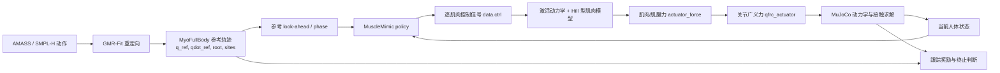

# MuscleMimic 原理：从动作轨迹到肌肉驱动的人体 Tracker

## 1. 一句话定义

MuscleMimic 是一个肌肉骨骼人体的**闭环动作跟踪器**：参考轨迹规定人体在未来应该怎样运动，策略根据当前仿真状态输出每条肌肉的控制信号，MuJoCo 把肌肉控制转换为肌肉力和关节广义力，最终让完整人体在接触动力学中跟踪参考动作。

它不是一个直接播放 `qpos` 的运动学播放器，也不是一个直接输出各关节力矩的普通机器人策略。

## 2. 完整执行链



对应代码入口：

- [MyoFullBody 环境](../musclemimic/environments/humanoids/myofullbody.py)
- [全身训练配置](../fullbody/conf_fullbody.yaml)
- [轨迹目标](../musclemimic/core/goals/trajectory.py)
- [轨迹奖励](../musclemimic/core/reward/trajectory_based.py)
- [默认动作映射](../loco_mujoco/core/control_functions/default.py)

## 3. Tracker 的输入和输出

### 3.1 参考轨迹不是控制力矩

GMR cache 主要保存：

- 全身 `qpos`、`qvel`；
- root 位置和姿态；
- body/site 的位置、姿态与速度；
- 轨迹频率和关节名称。

这些量描述“应该到达的运动”，但不包含 MuscleMimic policy 实际执行时产生的肌肉激活、肌肉力和关节力矩。

因此必须区分：

| 数据 | 来源 | 含义 |
|---|---|---|
| reference trajectory | GMR cache | 动作跟踪目标 |
| policy action | 神经网络 | 归一化的肌肉控制命令 |
| actual rollout state | MuJoCo | policy 真正在物理环境中产生的状态 |
| `qfrc_actuator` | MuJoCo rollout | 所有执行器在关节坐标中的主动广义力 |

用于后续力矩回放的数据必须从**成功的完整人体物理 rollout** 中导出，不能只从 GMR reference cache 读取。

### 3.2 策略输出的是肌肉控制信号

完整人体策略可写成

\[
u_t=\pi_{MM}(o_t,r_{t:t+N}),
\]

其中：

- \(o_t\) 是当前人体状态；
- \(r_{t:t+N}\) 是当前和未来参考状态；
- \(u_t\) 是每条肌肉执行器的控制/兴奋命令。

当前默认控制器先把神经网络动作从 `[-1,1]` 映射到各执行器的 `ctrlrange`，再写入 `data.ctrl`。

## 4. MuJoCo 怎样从肌肉得到关节力矩

对第 \(i\) 条肌肉，MuJoCo 根据控制信号、激活状态、肌肉长度和收缩速度计算肌肉—肌腱力：

\[
a_{i,t+1}=f_{act}(a_{i,t},u_{i,t}),
\]

\[
F_{i,t}=f_{Hill}(a_{i,t},l_{i,t},\dot l_{i,t}).
\]

肌肉力沿肌腱路径作用，通过随姿态变化的力臂映射到关节坐标：

\[
\tau_{muscle,t}=R(q_t)^T F_t.
\]

多条肌肉可能同时影响一个关节，一条双关节肌肉也可能同时影响多个关节。MuJoCo 将所有执行器贡献汇总为：

```text
data.qfrc_actuator.shape == (model.nv,)
```

随后统一求解：

\[
M(q)\ddot q + C(q,\dot q)+g(q)
=qfrc_{actuator}+qfrc_{passive}+qfrc_{constraint}+qfrc_{applied}.
\]

这里写成分项形式是为了理解；MuJoCo 内部会结合约束、接触和数值积分一起求解。

## 5. 关键 MuJoCo 变量

| 变量 | 含义 | 本项目中的用途 |
|---|---|---|
| `data.ctrl` | 给执行器的控制输入 | 完整人体阶段保存用于审计，不作为新方法的人体回放量 |
| `data.act` | 肌肉激活等内部状态 | 验证肌肉执行器确实工作 |
| `data.actuator_force` | 每个执行器实际产生的力/力矩 | 肌肉贡献分析 |
| `data.qfrc_actuator` | 执行器映射到全部 `nv` 广义坐标后的主动广义力 | 新方法的主要导出和回放量 |
| `data.qfrc_passive` | 关节、肌腱等被动力 | 回放环境会自行计算，不重复注入 |
| `data.qfrc_applied` | 用户额外施加的广义力 | 人体参考力矩和假肢 policy 力矩的注入口 |
| `data.qfrc_constraint` | 接触/约束产生的广义力 | 只记录和评估，不回放 |

### 为什么选择 `qfrc_actuator`

新方法希望回答：如果把完整人体的肌肉控制等效为关节广义力，怎样让非假肢人体按相同方式被驱动？

应使用成功 rollout 中的 `qfrc_actuator`，因为它已经包含：

- 所有肌肉实际产生的执行器力；
- 肌腱传动和姿态相关力臂；
- 双关节肌肉对多个 DOF 的同时贡献；
- 各肌肉贡献在关节坐标中的合成结果。

不要使用以下量替代：

- `qfrc_inverse` 或逆动力学总力：可能混入重力、加速度和约束平衡项；
- `qfrc_constraint`：这是接触求解结果，必须由新状态重新计算；
- `qfrc_passive`：回放模型本身还会再次计算，重复注入会双计数；
- 单独的膝踝肌肉列表：会丢失双关节肌肉在髋等其他 DOF 上的贡献。

## 6. 时间分辨率

本地 MyoFullBody 默认：

- MuJoCo 物理步长：`0.002 s`，即 500 Hz；
- 每个 policy 控制步：5 个物理子步；
- policy/参考轨迹频率：约 100 Hz。

肌肉力会在 5 个物理子步中随状态变化。为了高保真力矩回放，导出器应在每个 `mj_step` 前后记录：

```text
qfrc_actuator_substep: [T_control, 5, nv]
```

同时保存便于训练和分析的控制步平均值：

```text
qfrc_actuator_mean: [T_control, nv]
```

第一版可以用每控制步平均力矩做 100 Hz 回放，但必须和 500 Hz 子步回放做误差对照。若两者差异明显，正式训练使用逐子步力矩。

## 7. 为什么完整 rollout 必须先通过审计

MuscleMimic 是 tracker，但并不意味着每个 GMR 动作都被 checkpoint 完整、稳定地复现。导出前必须确认：

- 从轨迹起点到终点没有 reset；
- `done_count == 0`；
- root 没有倒地或明显漂移；
- site/qpos/qvel 跟踪误差在允许范围；
- 足地接触和 GRF 没有明显异常；
- `qfrc_actuator` 没有 NaN、Inf 或异常尖峰。

只有通过这些条件的完整人体 rollout 才能成为人体力矩回放和假肢 baseline 的数据源。

## 8. 对新假肢训练方法的直接结论

完整人体阶段的 MuscleMimic 负责把“参考动作”转化为一条物理可执行轨迹：

\[
\mathcal D_{full}
=\{q_t,\dot q_t,qfrc_{actuator,t},contact_t,reference_t\}_{t=0}^{T}.
\]

新假肢方法不再执行原始肌肉策略，而是把这条成功 rollout 转换成关节力矩 tracker：

- 非假肢 DOF：回放 `qfrc_actuator`；
- 假肢 4 DOF：移除原力矩，改由 baseline + policy residual 产生；
- 接触、重力、惯性和被动力：继续由 MuJoCo 根据当前状态计算。

具体方案见：[左膝—左踝假肢训练计划](PROSTHESIS_TRAINING_PLAN.md)。
