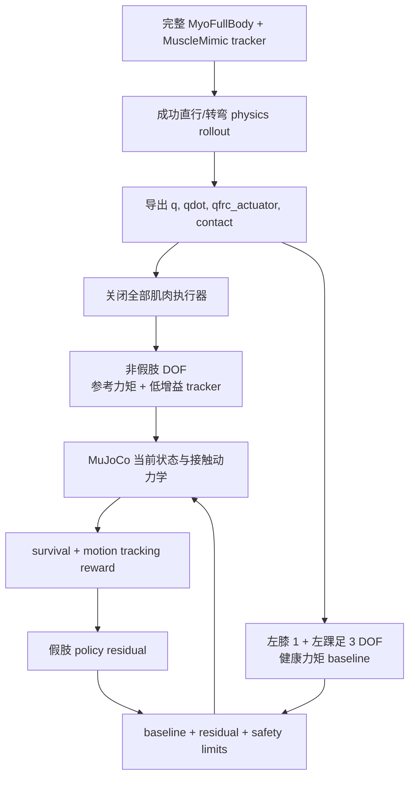

# 左膝 1 DOF—左踝 3 DOF 假肢训练计划

## 1. 本文档的训练目标

重新搭建一条独立、最小且可验证的假肢训练路线：

1. 用官方 MuscleMimic checkpoint 让完整肌肉人体跟踪若干直行和转弯动作；
2. 从成功 rollout 导出完整人体状态和等效关节广义力矩；
3. 构建关节力矩回放环境，关闭原始肌肉执行器；
4. 非假肢人体 DOF 回放健康人体的参考广义力矩；
5. mask 左膝和左踝—足复合体 4 DOF 的参考执行力矩；
6. 以 mask 前健康人体在这 4 个 DOF 上的力矩作为 baseline；
7. 假肢 policy 从零 residual 开始，通过闭环强化学习保持人体不跌倒并继续跟踪动作。

本文档不继承之前的假肢训练、蒸馏、student 或 DAgger 方案。旧代码只可作为 MuJoCo API 和关节映射参考，不能决定新方法的数据、动作和训练语义。

## 1.1 当前实现状态

新代码已经放在独立路径：

```text
/home/user/Workspace/Proknee-RL-muscle/torque_replay_training
```

当前已实现并实际运行：

- 官方 checkpoint 的完整人体 rollout；
- 100 Hz 控制步、500 Hz 物理子步的主动广义力导出；
- 带 schema 和 metadata 校验的 `.npz` 数据；
- 原 actuator 全部失活后的 `qfrc_applied` 力矩回放；
- 非假肢人体 DOF 与 4 个假肢 DOF 的严格分区；
- 健康 baseline + 四维 residual PPO；
- 多 motion 数据在 episode reset 时随机采样；
- 回放等价性、单元测试、checkpoint 保存/加载及端到端 smoke。

2026-07-23 的 schema v2 修复后，四条本机完整轨迹已通过全长 all/split 回放和随机起点
窗口验证。关键物理转移量使用 float64，并恢复 MuJoCo `qacc_warmstart`。旧 schema v1
数据会在长时间接触回放中发散，不能用于训练。

当前版本记录接触数量 `contact_ncon`，接触力由 MuJoCo 重新求解；逐足 GRF、足底滑移和视频报告仍属于后续评估增强项，不应声称已经实现。

## 2. 假肢控制边界

### 2.1 四个主动 DOF

当前 MyoFullBody 模型中的目标关节是：

| 物理分组 | MuJoCo joint | 动作维度 |
|---|---|---:|
| 左膝屈伸 | `knee_angle_l` | 1 |
| 左踝主关节 | `ankle_angle_l` | 1 |
| 左距下关节 | `subtalar_angle_l` | 1 |
| 左 MTP/趾关节 | `mtp_angle_l` | 1 |

代码中的现有映射可在 [proknee/constants.py](../musclemimic/proknee/constants.py) 核对。

本文把后三项统称为“左踝—足复合体 3 DOF”。需要注意，`mtp_angle_l` 解剖上是趾关节，不是真正的三轴踝旋转。如果未来真实假肢的 3 DOF 是踝跖屈/背屈、内翻/外翻和轴向旋转，则必须先修改 MuJoCo 关节模型，不能直接把 MTP 当作第三个踝轴。

### 2.2 DOF 分区

设：

- \(P\)：上述 4 个假肢 `qvel/dof` 索引；
- \(H\)：除 \(P\) 外的所有广义 DOF，包括 free-root；
- \(R\)：6 个 free-root DOF。

执行时：

```text
R: 回放记录的 qfrc_actuator root 分量；其物理值应接近零，且不加 PD
H: 回放完整人体参考 qfrc_actuator；标量健康关节可加入低增益跟踪稳定项
P: 不回放人体执行力矩，改用假肢 baseline + policy residual
```

这里的 root 分量不是人为添加的稳定外力，而是完整 `qfrc_actuator` 向量中的原始数值。
肌肉属于内部作用，理论 root 合力接近零；保留约 `1e-13` 的数值项是为了避免接触系统把
舍入扰动放大并破坏精确回放。

这种按 DOF 分区的方式会保留双关节肌肉在髋等非假肢 DOF 上的贡献，比“按肌肉名字删除一组肌肉”更符合本方法的等效力矩定义。

## 3. 第一批候选完整人体动作

以下 GMR cache 已在本地确认存在且频率为 100 Hz：

| 类型 | motion path | 帧数 | 时长 |
|---|---|---:|---:|
| 中速直行 | `KIT/314/walking_medium09_poses` | 773 | 7.73 s |
| 慢速直行 | `KIT/425/walking_slow07_poses` | 532 | 5.32 s |
| 右转 | `KIT/167/turn_right01_poses` | 675 | 6.75 s |
| 左转 | `KIT/167/turn_left01_poses` | 537 | 5.37 s |
| 逆时针曲线行走 | `KIT/4/WalkInCounterClockwiseCircle04_poses` | 840 | 8.40 s |

前四条已经在本机导出为 `torque_replay_training/data/fullbody_v2`，并通过完整 tracker
资格检查、全长力矩回放和随机起点检查。圆周行走仍只是候选 reference。任何新增动作都
必须先由完整人体 policy 从头到尾 rollout，并通过 §4 的门槛。

## 4. Phase A：完整人体跟踪与轨迹筛选

### A1. 固定评测条件

- checkpoint：`/home/user/Workspace/musclemimic/data/checkpoints/mm-10m-2`；
- 环境：健康 `MyoFullBody`；
- policy：deterministic；
- 固定 seed；
- 轨迹从第 0 帧开始；
- 不允许 episode reset 后拼接；
- 终止标志必须记录，筛选时不能用 `NoTerminal` 隐藏失败。

正式导出器是 [exporter.py](../torque_replay_training/src/torque_replay_training/exporter.py)，命令入口是 [export_fullbody_rollout.py](../torque_replay_training/scripts/export_fullbody_rollout.py) 和批量入口 [collect_rollouts.py](../torque_replay_training/scripts/collect_rollouts.py)。它直接镜像上游 `LocoMuJoCo.step()`，并把内部 5 个物理子步拆开记录。

### A2. 合格门槛

一条轨迹只有同时满足以下条件才进入训练集：

1. 完整走到 reference 最后一帧；
2. `done_count == 0`，没有 reset；
3. root 高度和朝上方向没有达到跌倒阈值；
4. qpos/qvel/site 跟踪误差没有持续发散；
5. 左右足接触顺序与 reference 动作合理一致；
6. `qfrc_actuator`、`actuator_force`、状态中无 NaN/Inf；
7. 关节力矩没有由数值爆炸产生的异常尖峰。

建议为每条候选生成：

```text
outputs/torque_replay/fullbody/<safe_motion>/
├── rollout.mp4
├── rollout.npz
├── metrics.json
└── metadata.json
```

## 5. Phase B：导出可回放数据

### B1. 当前导出器

```text
torque_replay_training/src/torque_replay_training/exporter.py
```

导出器已经进入 `env.step()` 内部的物理子步，在每次单步 `mujoco.mj_step(..., 1)` 前执行 `mj_forward` 并采样动力学量。仅在一个控制步结束后读取一次 `data.qfrc_actuator`，不能代表该控制步内全部 5 个子步。

### B2. 数据格式

建议每条 motion 保存一个 `.npz`：

| 字段 | 形状 | 说明 |
|---|---|---|
| `reference_qpos` | `[T, nq]` | GMR 参考状态 |
| `reference_qvel` | `[T, nv]` | GMR 参考速度 |
| `rollout_qpos` | `[T+1, nq]` | 成功 policy rollout 状态，含初始状态 |
| `rollout_qvel` | `[T+1, nv]` | 成功 policy rollout 速度 |
| `rollout_qacc` | `[T, S, nv]` | float64 子步加速度；用于恢复 warmstart |
| `policy_action` | `[T, na]` | 完整人体策略动作，仅审计 |
| `actuator_ctrl` | `[T, S, nu]` | 实际肌肉 ctrl，仅审计 |
| `actuator_force` | `[T, S, nu]` | 实际肌肉力 |
| `qfrc_actuator` | `[T, S, nv]` | float64 正式回放主动广义力 |
| `qfrc_actuator_mean` | `[T, nv]` | float64 每控制步平均值 |
| `qfrc_passive` | `[T, S, nv]` | 被动力审计，不回放 |
| `qfrc_constraint` | `[T, S, nv]` | 接触/约束审计，不回放 |
| `contact_ncon` | `[T, S]` | MuJoCo 子步接触数量，用于基础审计 |

metadata 必须保存：

- motion path、checkpoint、seed；
- `dt_control`、`dt_physics`、`n_substeps`；
- `joint_names`、每个 joint 的 `qposadr/dofadr`；
- `actuator_names`；
- `nq/nv/nu`；
- 4 个假肢 DOF 的名字和索引；
- 合格门槛结果。

当前 schema 没有单独存 `time_control/time_physics`，因为二者可由整数索引与 metadata 中的 `dt_control/dt_physics` 无歧义恢复。若模型资产会频繁变化，下一版应再加入 XML/hash 审计；当前加载阶段会严格比较 `nq/nv`、物理步长和完整 joint 顺序。

`rollout_qacc` 和 `qfrc_actuator` 不得降为 float32。已有实验表明，约 `1e-5` RMS 的力
量化误差会在 1–1.5 秒后被足地接触动力学放大到不同的接触模式。

### B3. 必须保证的时间语义

对控制步 \(t\)：

```text
rollout_qpos[t], rollout_qvel[t]
    -- qfrc_actuator[t, 0:S] -->
rollout_qpos[t+1], rollout_qvel[t+1]
```

不能把 post-step 力矩和 pre-step 状态错一帧配对。导出后应随机抽取若干帧打印时间、状态和力矩索引进行 spot check。

## 6. Phase C：建立人体关节力矩回放环境

### C1. 关闭所有原始肌肉执行器

如果人体将由导出的关节广义力驱动，就不能同时保留原始 actuator 输出，否则会产生双重驱动：

\[
qfrc_{actual}=qfrc_{muscle}+qfrc_{replay}.
\]

回放环境必须在每个物理子步：

1. 将全部 actuator 的 `data.ctrl` 置零；
2. 将全部 activation state `data.act` 置零；
3. 在模型层清零所有 actuator 的 gain 和 bias，确保 `data.qfrc_actuator` 的贡献近似为零；
4. 再通过 `data.qfrc_applied` 注入参考关节力矩和假肢力矩。

只把 `ctrl=0` 不一定足够，因为肌肉可能仍有激活状态或被动力。必须用 `qfrc_actuator` 审计确认不存在重复出力。

### C2. 人体力矩回放

纯开环回放为：

\[
\tau_H(t,s)=qfrc_{actuator}^{full}(t,s)[H].
\]

当假肢 policy 造成状态偏离时，同一参考力矩不一定还能稳定人体。因此正式训练环境建议使用“参考力矩 + 低增益跟踪稳定项”：

\[
\tau_H^{cmd}
=\tau_H^{ref}
+K_{p,H}(q_H^{ref}-q_H)
+K_{d,H}(\dot q_H^{ref}-\dot q_H).
\]

这个稳定项只作用于非假肢标量关节，不对 free root 添加 PD，也不替假肢控制四个目标
关节。free root 只接收记录向量中理论上接近零的 actuator 分量，其余运动由重力、关节
力矩和 MuJoCo 接触共同产生。

必须同时保留两个基线：

- `pure_replay`：只回放 \(\tau_H^{ref}\)，用于检查数据忠实度；
- `stabilized_replay`：加入低增益 PD，作为假肢正式训练的人体控制方式。

### C3. 接触力不能回放

导出的 GRF 和 `qfrc_constraint` 只用于比较和奖励。正式回放中，足地接触、摩擦、GRF 和约束力必须由 MuJoCo 根据当前状态重新求解，否则假肢策略无法真正影响平衡。

## 7. Phase D：构造假肢 baseline 与 policy

### D1. mask 前的健康假肢力矩

从完整人体数据中取 4 个假肢 DOF：

\[
\tau_P^{base}(t,s)
=qfrc_{actuator}^{full}(t,s)[P].
\]

这是健康肌肉人体在同一动作、同一时刻产生的等效关节力矩。mask 后不再直接由人体回放器注入，而是进入假肢控制器作为 baseline。

### D2. residual policy

policy 输出四维归一化残差：

\[
a_t=\pi_P(o_t)\in[-1,1]^4,
\]

\[
\Delta\tau_t=a_t\odot\tau_{residual\_limit},
\]

\[
\tau_P^{cmd}
=\operatorname{clip}
(\tau_P^{base}+\alpha\Delta\tau_t,
-\tau_{limit},\tau_{limit}).
\]

其中：

- policy 输出层零初始化，使训练第 0 步 `Delta tau = 0`；
- 初始状态严格等于健康人体 baseline；
- `alpha` 从小到大做 curriculum，避免随机 policy 一开始破坏稳定动作；
- 最终力矩还需经过 slew-rate 和低通限制。

baseline 按 500 Hz 子步读取；policy 以 100 Hz 更新一次，当前 residual 在 5 个物理子步中保持。当前版本已经实现力矩幅值 clip 和 action-rate 奖励惩罚；显式 slew-rate/低通滤波与自动 `alpha` curriculum 尚未实现，可在完整 baseline 验证后加入。

### D3. policy 观测

当前阶段只训练仿真 privileged policy，不考虑部署蒸馏。当前 39 维观测实际包含：

- 归一化 phase 的正余弦；
- 4 个假肢关节的 `q/qd`；
- 4 个假肢关节相对 reference 的误差；
- 当前 baseline 力矩 `tau_P_base`；
- 上一时刻假肢 residual 和实际力矩；
- pelvis 位姿、线速度、角速度；
- 非假肢人体关节跟踪误差的紧凑统计；
- pelvis/root 高度、朝上方向及 6 维 root 速度；
- 当前 MuJoCo 接触数量。

motion id、未来 reference 窗口、逐足 GRF、足底滑移和观测历史是正式扩展项，当前首版尚未输入 policy。

不要把完整人体原始肌肉 `ctrl/activation` 作为必需输入，因为新方法执行阶段已经不再使用肌肉系统。

## 8. Phase E：强化学习任务

### E1. 目标不能只有“不摔倒”

如果奖励只有 survival，policy 可能通过僵硬、拖脚或偏离目标动作来延长存活。MuscleMimic 是 tracker，因此假肢训练也应保留跟踪目标：

\[
r_t=
w_{alive}r_{alive}
+w_{track}r_{track}
+w_{contact}r_{contact}
-w_{fall}c_{fall}
-w_{limit}c_{limit}
-w_{res}c_{residual}
-w_{rate}c_{rate}.
\]

完整版本建议包括：

- survival、root 高度和朝上方向；
- root、pelvis、关键 sites 的轨迹跟踪；
- 左膝和左踝—足 4 DOF 的 q/qd 跟踪；
- 接触时序、足底滑移和 GRF 合理性；
- 关节限位、力矩限位、功率和力矩变化率；
- residual 大小，使 policy 优先保留健康 baseline，只在需要时修正。

当前首版奖励已实现：非假肢标量关节跟踪、假肢 4 DOF 跟踪、root 高度/朝上、生存项、residual 大小和 action-rate 惩罚。逐足接触时序、滑移、GRF、功率和 site tracking 尚未实现，应在首批完整 motion 通过回放后补入，不能把当前 smoke 当作最终奖励设计验证。

### E2. reset 和初始状态

- 从成功 fullbody rollout 的随机合法帧初始化 `qpos/qvel`；
- 同时设置 `time=start_step*dt_control`，并用前一物理子步的 float64
  `rollout_qacc[start_step-1,-1]` 恢复 `qacc_warmstart`；
- replay index、reference index 和 baseline index 必须一致；
- 优先从双支撑或稳定接触帧开始，再逐渐开放任意帧；
- episode 先短后长；
- 跌倒后重新从数据中的合法帧初始化，不能接着使用原时间索引。

### E3. curriculum

1. 单条中速直行，`alpha=0`，验证 baseline；
2. 单条直行，小 residual limit；
3. 慢速 + 中速直行混合；
4. 加入左右转；
5. 加入曲线行走；
6. 随机初始帧、状态扰动和力矩噪声；
7. 增大 residual 能力并测试未参与训练的 clip。

策略算法首版可使用 PPO。此处不需要 teacher/student、latent 蒸馏或动作克隆网络；baseline 已直接来自 mask 前的健康等效力矩。

## 9. 必须先通过的三个回放测试

### Test 1：完整广义力替换等价性

关闭全部 actuator，将完整人体 `qfrc_actuator` 向量原样注入，用于验证“muscle actuator → 等效广义力”的替换边界。正式 `split` 模式不会主动控制 free root。

期望：从完全相同初始状态开始，短时间 rollout 应接近原完整人体轨迹。若这里立即发散，说明导出时序、肌肉关闭方式或力矩注入错误，不能开始假肢训练。

### Test 2：DOF 分区一致性

非假肢 DOF 走人体回放通道，4 个假肢 DOF 走 baseline 通道，但两者施加的数值仍都等于原始 `qfrc_actuator`。

期望：结果与 Test 1 数值一致。若不一致，说明 DOF mapping、动作顺序或力矩缩放错误。

### Test 3：零残差 policy 一致性

接入 policy，但把输出固定为零。

期望：结果与 Test 2 一致。若不一致，说明 residual 合成、clip、slew-rate 或控制频率处理改变了 baseline。

只有三个测试依次通过后，才允许 policy 输出非零残差。

## 10. 训练和验证划分

第一轮建议：

- 训练：中速直行、慢速直行、一个左转、一个右转；
- 验证：不同 subject/clip 的直行、左转和右转；
- 曲线动作可以先用于验证，再加入第二轮训练。

不能只随机切同一条轨迹的帧，因为相邻帧高度相关。train/validation 应按完整 motion path 划分。

## 11. 当前代码结构

```text
torque_replay_training/
├── src/torque_replay_training/
│   ├── schema.py                 # versioned NPZ schema 和索引校验
│   ├── upstream.py               # 官方环境/checkpoint/policy 适配
│   ├── exporter.py               # 完整人体子步动力学记录
│   ├── replay_env.py             # actuator 失活、力矩回放、奖励和接触重算
│   ├── control.py                # baseline + residual + 限幅
│   ├── validation.py             # all/split 回放等价性
│   └── ppo.py                    # 零均值初始化的四维 residual PPO
├── scripts/
│   ├── collect_rollouts.py
│   ├── export_fullbody_rollout.py
│   ├── validate_replay.py
│   ├── train_policy.py
│   ├── evaluate_policy.py
│   └── run_smoke.sh
├── configs/{train,smoke}.yaml
└── tests/
```

新模块不依赖旧的假肢训练 checkpoint、旧 Stage 1/2 数据或蒸馏数据。

## 11.1 环境

从 workspace 根目录运行：

```bash
cd /home/user/Workspace/musclemimic
if [[ -x musclemimic/.venv/bin/python ]]; then
  PYTHON="$PWD/musclemimic/.venv/bin/python"  # 当前嵌套 checkout
else
  PYTHON="$PWD/.venv/bin/python"              # 标准 Git clone
fi
```

本次实际测试版本：

| 组件 | 版本 |
|---|---|
| Python | 3.11.15 |
| MuJoCo | 3.4.0 |
| JAX | 0.7.2 |
| Flax | 0.12.0 |
| Optax | 0.2.8 |

默认完整人体 checkpoint 是 `/home/user/Workspace/musclemimic/data/checkpoints/mm-10m-2`。脚本通过上游 checkout 的 `.venv` 和源码运行，不需要安装这个新目录为 wheel。

## 11.2 正式数据收集

以下命令不使用 `--allow-incomplete`，因此任何 motion 未完整走完都会记录到 `manifest.json` 并返回非零：

```bash
$PYTHON torque_replay_training/scripts/collect_rollouts.py \
  --output-dir torque_replay_training/data/fullbody \
  --motion KIT/314/walking_medium09_poses \
  --motion KIT/425/walking_slow07_poses \
  --motion KIT/167/turn_right01_poses \
  --motion KIT/167/turn_left01_poses
```

每条正式数据还必须运行：

```bash
$PYTHON torque_replay_training/scripts/validate_replay.py \
  --dataset torque_replay_training/data/fullbody/KIT_314_walking_medium09_poses.npz
```

## 11.3 多轨迹训练和评估

```bash
$PYTHON torque_replay_training/scripts/train_policy.py \
  --config torque_replay_training/configs/train.yaml \
  --dataset torque_replay_training/data/fullbody/*.npz \
  --output torque_replay_training/outputs/train_v1
```

```bash
$PYTHON torque_replay_training/scripts/evaluate_policy.py \
  --config torque_replay_training/configs/train.yaml \
  --dataset torque_replay_training/data/fullbody/*.npz \
  --policy torque_replay_training/outputs/train_v1/policy_000200000.msgpack \
  --episodes 20
```

PPO 的输出层均值零初始化，所以 deterministic policy 在更新前输出严格为零；随机训练采样仍由 `initial_log_std` 提供探索。每次 reset 会从输入的 motion 数据中随机选一条，再从合法帧随机初始化。

## 11.4 Smoke 测试

```bash
bash torque_replay_training/scripts/run_smoke.sh
```

2026-07-15 本机实测结果：

- 单元测试：5 passed；
- tracker 导出：8 控制步、每步 5 个物理子步；
- 完整力矩替换相对原 rollout：`qpos max_abs = 4.99e-9`，`qvel max_abs = 8.60e-8`；
- `split + zero residual` 相对完整力矩替换：`qpos max_abs = 7.01e-15`，`qvel max_abs = 2.65e-13`；
- PPO：32 环境步、2 次 update，成功写出并重新加载 checkpoint；
- 确定性评估：8/8 步完成，`falls = 0`。

这只是代码通路 smoke，使用了 `--steps 8 --allow-incomplete`，不代表 773 帧完整行走已经合格，也不代表策略已学会泛化。正式结论必须使用完整动作数据和独立 validation motion。

## 12. 最终数据流



## 13. 方法成功的最低标准

新训练方法至少应证明：

1. 完整人体成功 rollout 能被正确导出；
2. 关闭肌肉后的全 DOF 力矩回放在短期内与原 rollout 等价；
3. DOF 分区和零 residual 不改变 baseline；
4. policy 训练后在训练动作上不跌倒并保持动作跟踪；
5. policy 在未见过的直行/转弯 clip 上优于零 residual baseline；
6. 改善不是通过 root 外力、接触力回放或硬锁人体状态获得的。
